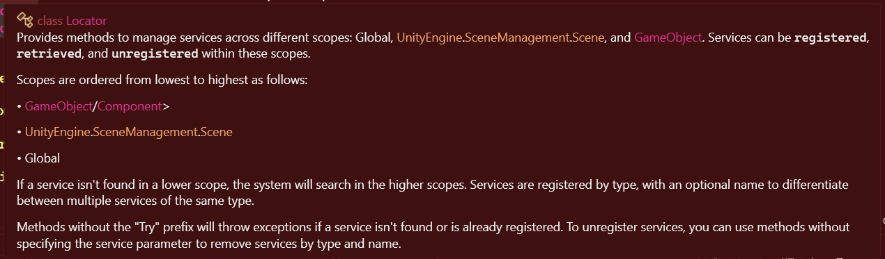
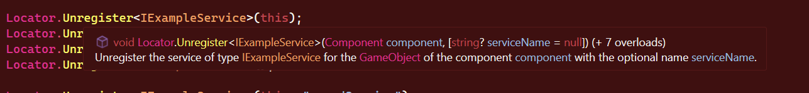
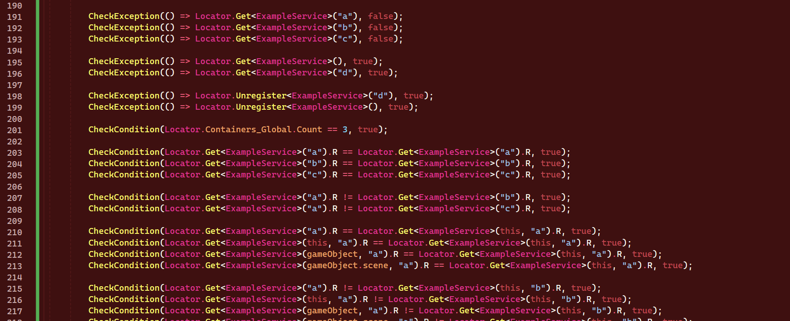

# TheLocator
A service locator implementation for Unity with that supports multiple services of a single type and has consideration for gameobjects, scenes and the global scope. 

## About
This implementation of the pattern defines containers/scopes for gameobjects, scenes and the global scope. It allows the user to get, register or unregister services within these scopes. An optional name can also be provided to later identify a service beside its type, allowing multiple instances of a single type to be registered. Getting of a service is delegated to higher level scopes if a lower one fails.

This package does not create any extra overhead and uses regular C# objects. It integrates into Unity and initializes itself with the usage of the `RuntimeInitializeOnLoadMethod` attribute. EnterPlaymodeOptions are also supported as the static fields are overridden and initialized automatically when required.

## Installation
Having the necessary scripts on the project is all that is needed. This package is best installed with the Unity Package Manager via the git URL.

1. Open the Unity Package Manager.
2. Select "Add package from git URL..."  
3. Paste ` https://github.com/SametHope/the-locator.git#main ` as the URL.
4. Done.

### Optional
I also highly recommend installation of the [Unity3D-SerializableInterface](https://github.com/Thundernerd/Unity3D-SerializableInterface) package together with this package. It's installation requires more work than this one. If you have NPM and openupm-cli, follow instructions on the repo above, otherwise follow the guide below.

1. Make sure there are no compilation errors on the project.
2. Download the [Installer .unitypackage](https://package-installer.glitch.me/v1/installer/package.openupm.com/net.tnrd.serializableinterface?registry=https://package.openupm.com).
3. Import the whole package. This will trigger the installation of the actual package.
4. Done.

## Usage
Services must be manually added and removed as one would expect.

### Register Services
```cs
// Register a service for this gameobject via its component, itself, its scene and the global scope in order
Locator.Register<IExampleService>(serviceObject, this);
Locator.Register<IExampleService>(serviceObject, gameObject);
Locator.Register<IExampleService>(serviceObject, gameObject.scene);
Locator.Register<IExampleService>(serviceObject);

// Do the same but with a named service
Locator.Register<IExampleService>(serviceObject, this, "namedService");
Locator.Register<IExampleService>(serviceObject, gameObject, "namedService");
Locator.Register<IExampleService>(serviceObject, gameObject.scene, "namedService");
Locator.Register<IExampleService>(serviceObject, "namedService");

// Use functions with Try prefix to not get exceptions if the operation fails
Locator.TryRegister<IExampleService>(serviceObject, this);
Locator.TryRegister<IExampleService>(serviceObject, this, "namedService");
...
```

### Unregister Services
```cs
// Unregister a service for this gameobject via its component, itself, its scene and the global scope in order
Locator.Unregister<IExampleService>(this);
Locator.Unregister<IExampleService>(gameObject);
Locator.Unregister<IExampleService>(gameObject.scene);
Locator.Unregister<IExampleService>();

// Do the same but with a named service
Locator.Unregister<IExampleService>(this, "namedService");
Locator.Unregister<IExampleService>(gameObject, "namedService");
Locator.Unregister<IExampleService>(gameObject.scene, "namedService");
Locator.Unregister<IExampleService>("namedService");

// Use functions with Try prefix to not get exceptions if the operation fails
Locator.Unregister<IExampleService>(this);
Locator.TryUnregister<IExampleService>(serviceObject, this, "namedService");
...
```

### Get Services
```cs
// Get a service for this gameobject via its component, itself, its scene and the global scope in order
Locator.Get<IExampleService>(this);
Locator.Get<IExampleService>(gameObject); // Will check the scene if service is not found
Locator.Get<IExampleService>(gameObject.scene);// Will check the global scope if service is not found
Locator.Get<IExampleService>();

// Do the same but with a named service
Locator.Get<IExampleService>(this, "namedService");
Locator.Get<IExampleService>(gameObject, "namedService");
Locator.Get<IExampleService>(gameObject.scene, "namedService");
Locator.Get<IExampleService>("namedService");

// Use functions with Try prefix to not get exceptions if the operation fails
Locator.TryGet<IExampleService>(this, out var service);
Locator.TryGet<IExampleService>(this, out var namedService, "namedService");
...
```

### Misc
```cs
// If type is not provided it is assumed, these are also valid signatures
Locator.Register(serviceObject, gameObject.scene);
Locator.Unregister(serviceObject);
Locator.TryGet(this, out IExampleService namedService, "namedService");
...
```

### Documentation
All functions have XML documentation without exception. The `Locator` class even has a short summary of usage.  



### Tests
There are about 300 lines of tests that cover all functionality. 
